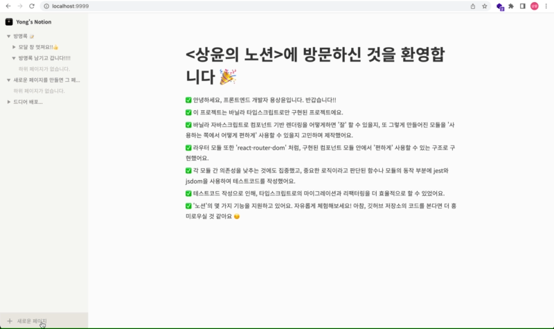

# 📄 상윤의 노션 2.0

과거에 구현했던 **[vanilla-notion-v1.0](https://github.com/ryong9rrr/vanilla-notion-v1.0)** 를 업그레이드 한 프로젝트입니다.

이 프로젝트는 **모든 기능이 바닐라 타입스크립트로 구현**되었습니다.

**노션** 서비스를 클로닝 한 프로젝트로, 일부 기능을 유사하게 지원합니다. [https://sangyoon-notion-vanilla.vercel.app/](https://sangyoon-notion-vanilla.vercel.app/) 에서 체험해보세요.

**문서들의 상태**는 거의 모든 컴포넌트의 주요 관심사가 됩니다. 이 관심사를 고립시켜 효과적으로 관리하기 위해 전역 상태 스토어를 사용했습니다. 이 전역 상태 스토어 또한 바닐라 타입스크립트만으로 구현되었으며 `sangyoon-ui`가 제공합니다.

> `sangyoon-ui`란?
> `sangyoon-ui`는 **제가 직접 바닐라 타입스크립트만으로 구현한 UI 프레임워크**입니다. `sangyoon-ui`는 컴포넌트 기반으로 UI를 그리고, 라우터와 전역 상태 스토어 기능을 제공합니다.
> **npm에 배포**되었고 [https://github.com/ryong9rrr/sangyoon-ui](https://github.com/ryong9rrr/sangyoon-ui) 에서 확인하실 수 있습니다.

## 🎥 주요 기능 스크린샷

#### 모달 : 글 생성

#### 사이드바 : 리사이징

#### 사이드바 : 토글, 문서 생성 및 삭제

#### 페이지 라우팅 및 렌더링

