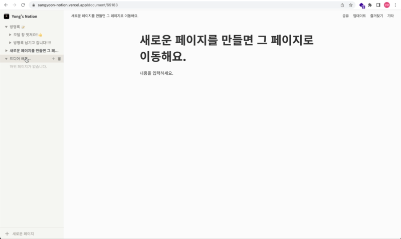
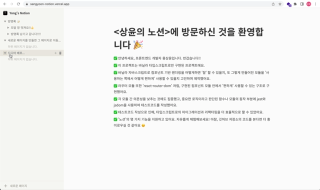
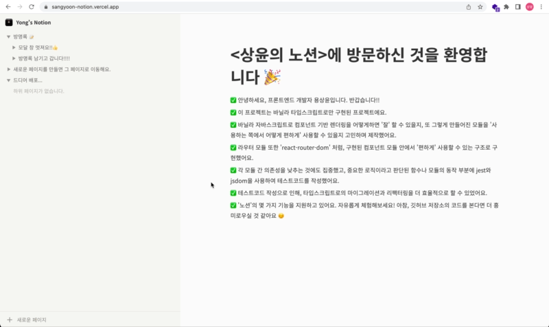

# 📄 상윤의 노션 2.0

과거에 구현했던 **[vanilla-notion-v1.0](https://github.com/ryong9rrr/vanilla-notion-v1.0)** 를 업그레이드 한 프로젝트입니다. "노션" 서비스를 클로닝 한 프로젝트로, 일부 기능을 유사하게 지원합니다.

바닐라 타입스크립트만으로 구현하였습니다. 타입과 테스트를 제외한 의존성 라이브러리는 사용하지 않았습니다.

## 🎥 주요 기능 스크린샷

#### 페이지 라우팅 및 렌더링



#### 사이드바 : 토글, 문서 생성 및 삭제



#### 사이드바 : 리사이징



#### 모달 : 글 생성

## 🗂️ 주요 모듈 요약

```
src --- @modules --- core // Component 슈퍼 클래스를 구현 및 테스팅
                     flux // 리덕스 구현
                     router // 라우터 구현
        @components // 컴포넌트 단위의 UI 컴포넌트
        @document-store // flux로 생성한 전역 상태 스토어, 리듀서 로직이 포함
        @pages // 페이지 단위의 UI 컴포넌트
        App.ts // 최상위 컴포넌트
        index.ts // 프로젝트 진입점, 여기서 라우팅을 세팅합니다.
```

## 🎯 핵심 모듈 소개

### @modules/core (Component)

상태 기반으로 UI를 렌더링하는 프레임워크를 바닐라 타입스크립트로만 구현하여 프로젝트에 적용하였습니다. 이 프레임워크를 다른 개발자가 사용한다는 가정 하에, 모듈 제공자의 입장에서 사용하는 쪽에서 편하게 사용할 수 있도록 기능을 구현하였습니다.

결과적으로 `Component`는 다음과 같은 기능을 제공합니다. 제공되는 메서드를 사용하여 컴포넌트를 구현할 수 있습니다.

```ts
// Props, State는 제네릭으로 기본값은 {} 이고 필요없다면 생략해도 됩니다.
class App extends Component<Props, State> {
	initState(){
		return {} // 여기서 App의 상태를 정의할 수 있고, 타입은 State와 동일해야합니다.
  }

  template(){
		return `<h1>Hello World!</h1>`
	}

	setEvent(){ // 여기서 이벤트를 정의합니다.
		this.addEvent("click", "h1", 핸들러A.bind(this)) // h1태그를 click했을 때의 이벤트
  }

	핸들러A(){
		this.setState(...) // setState 메서드를 사용해서 상태를 변경할 수 있습니다.
	}

	setChildren(){ // 여기서 하위 컴포넌트를 정의합니다. props를 넘길 수 있습니다.
		this.addComponent(하위 컴포넌트의 클래스, 하위 컴포넌트를 렌더링 시킬 DOM Selector, 하위 컴포넌트에게 넘길 props)
  }

	componentWillMount(){
		// 마운트되기 전에 실행할 동작, 전역상태스토어 구독은 여기서 해야합니다.
		// this.setProvider(전역상태스토어)
  }

	componentDidUpdate(){
		// 컴포넌트가 리렌더링된 이후에 수행할 동작
  }

	componentDidMount(){
		// 컴포넌트가 처음 렌더링 된 이후에 수행할 동작, 이 라이프사이클 메서드는 처음 한번만 수행됩니다.
  }
}
```

### @modules/router

Web API의 history API를 사용해서 SPA 앱을 만들 수 있도록 Router 라는 모듈을 설계하고자 했습니다. 그리고 이 라우터 모듈을 사용하는 방법은 **react-router-dom**와 유사하게 만들고 싶었습니다.

결과적으로 구현한 라우터 모듈은 아래와 같은 방식으로 사용할 수 있습니다.

```tsx
const router = createRouter(`#root`) // 최상위 DOM Selector를 주입합니다.
router.addRoute('/', Page)
router.addRoute(`/:documentId`, OtherPage)
router.setNotFoundView(NotFoundPage)
router.route()
```

라우터 인스턴스를 생성하기 위해 createRouter 라는 메서드를 사용합니다. 라우터 인스턴스는 전역 이벤트를 수행해야하기 때문에 App에서 단 한 번만 생성되어야 합니다. 이 메서드는 싱글톤 패턴으로 인스턴스를 생성합니다.

생성된 인스턴스에서 addRoute를 사용해서 경로와, 페이지에 사용될 컴포넌트 클래스를 주입시킵니다. 라우터는 내부적으로 라우터 테이블이라는 배열로 경로와 클래스 객체 자체를 관리하게 됩니다.

route()를 실행하면 브라우저의 url과 경로를 정규표현식으로 매칭시켜 해당 페이지를 렌더링하는 구조로 구현했습니다. 이 라우터 모듈은 Component 클래스에 의존적이며 react와 react-router-dom의 관계와 비슷합니다.
